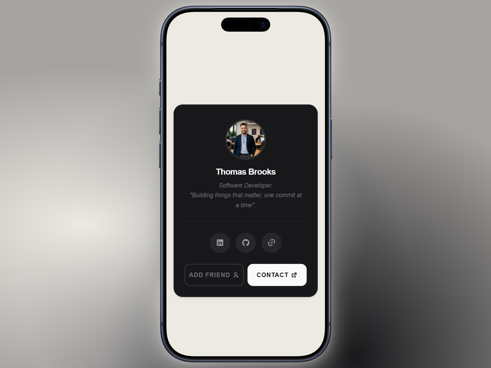
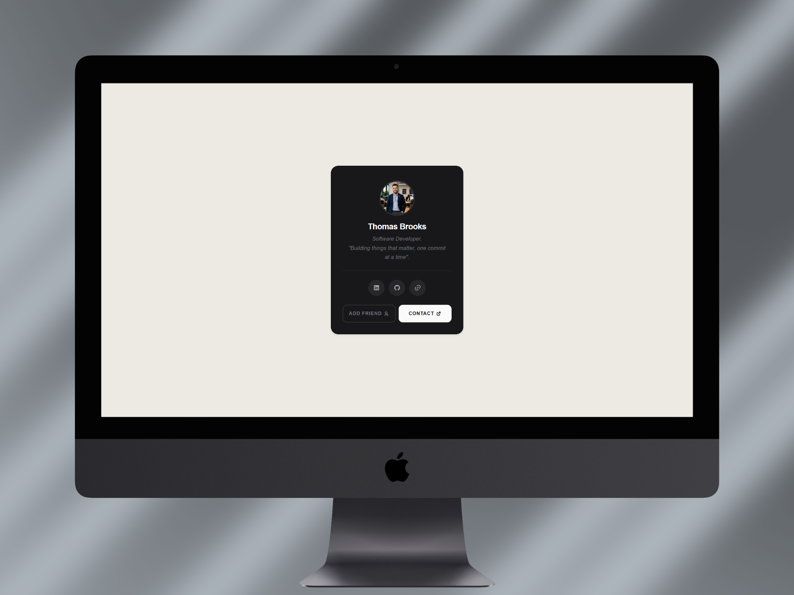

# Profile Card


A minimalist dark-themed profile card built with vanilla HTML and CSS. Displays a user avatar, name, bio, social links, and two call-to-action buttons. No JavaScript required. Fully responsive and accessible out of the box.

---

## Table of Contents

- [About](#about)
- [Features](#features)
- [Tech Stack](#tech-stack)
- [Live Demo](#live-demo)
- [Screenshots](#screenshots)
- [Getting Started](#getting-started)
- [Project Structure](#project-structure)
- [Accessibility](#accessibility)
- [License](#license)
- [Contact](#contact)
- [Support Me](#support-me)

---

## About

Profile Card is a frontend UI component built as part of a frontend development portfolio. It targets a common use case in social platforms and developer portfolios: a compact card that communicates identity and provides quick action points. The design uses a dark zinc color palette with Geist Sans for typography, prioritizing readability and clean visual hierarchy. No JavaScript is needed.

---

## Features

- Circular avatar with border styling
- Name and italic bio block
- Visual divider between bio and social links
- Three social icon buttons: LinkedIn, GitHub, and personal portfolio
- Two CTA buttons: Add Friend (outlined) and Contact (filled)
- Hover lift animation on the card
- Three responsive breakpoints (up to 360px max-width on desktop)
- Reduced motion support via `@media (prefers-reduced-motion: reduce)`
- Focus-visible outline for keyboard navigation

---

## Tech Stack

- HTML5
- CSS3 (custom properties, flexbox, clamp, transitions)
- Geist Sans font via jsDelivr CDN
- Remix Icons via jsDelivr CDN

---

## Live Demo

Live Demo available at: https://naxvenui-profile-card-1.netlify.app/

---

## Screenshots

**Profile Card - Smartphone Viewport**



**Profile Card - Desktop Viewport**



---

## Getting Started

No build step required. Clone or download the project and open `index.html` directly in your browser.

1. Clone the repository:

```bash
git clone https://github.com/NaxvenUI/profile-card-1.git
cd profile_card_1
```

2. Open the file in your browser:

```bash
open index.html       # macOS
start index.html      # Windows
xdg-open index.html   # Linux
```

Or use a local development server (recommended to avoid asset path issues):

```bash
npx serve .
```

Then open your browser and go to:

```
http://localhost:3000
```

---

## Project Structure

```
profile-card-1/
├── assets/
│   ├── css/
│   │   └── style.css
│   └── images/
│       └── profile.png
├── docs/
│   └── screenshots/
│       ├── mockup_1.png
│       └── mockup_2.png
├── index.html
├── LICENSE
└── README.md
```

---

## Accessibility

- The card uses a semantic `<article>` element with an `aria-label`.
- Social link anchors each carry a descriptive `aria-label` for screen readers.
- CTA buttons use `aria-label` attributes alongside visible text.
- `rel="noopener noreferrer"` is applied to all external links.
- Focus-visible styles are defined for both buttons and social icon links.
- All transitions respect the `prefers-reduced-motion` media query.

---

## License

Distributed under the MIT License. See the [LICENSE](LICENSE) file for details.

---

## Contact

**NaxvenUI**

[](https://www.youtube.com/@NaxvenUI)

[](https://www.tiktok.com/@naxvenui)

[](https://www.instagram.com/naxvenui)

[](https://x.com/NaxvenUI)

## Support Me

[](https://buymeacoffee.com/naxvenui)

[](https://ko-fi.com/naxvenui)

[](https://www.patreon.com/naxvenui)
